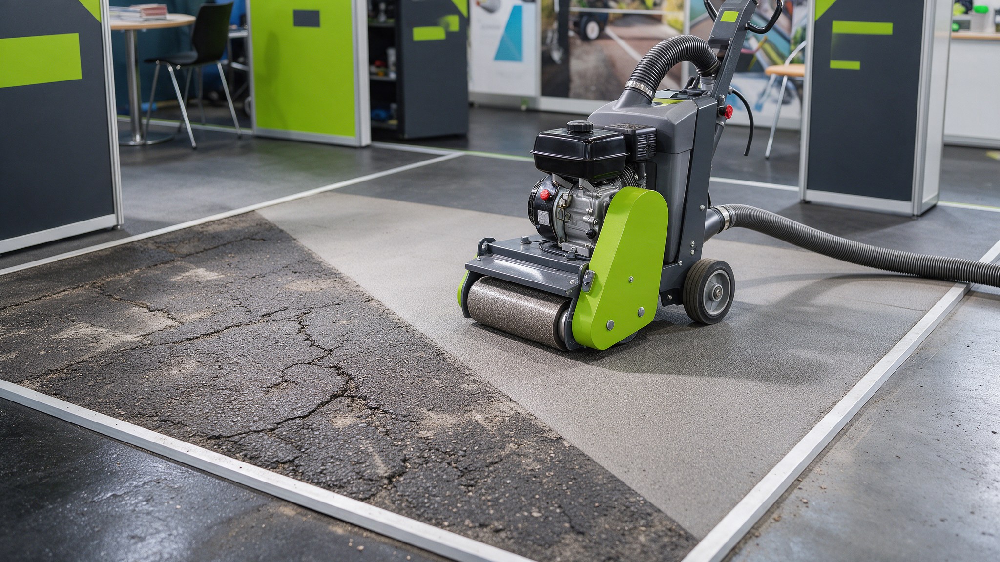

# A · Innovationspreis-Einreichungspaket (InfraTech 2027)

> **DRINGEND – Frist prüfen:** Faktencheck nennt Einsendeschluss **25.09.2026**. Vor Verwendung
> mit dem Veranstalter bestätigen (siehe Vorlage B). Bei 25.09. sofort einreichen.
>
> **Anzupassen (bitte bestätigen):** Der konkrete Innovationsinhalt ist hier als **empfohlener
> Aufhänger** formuliert. Falls eure eingereichte Innovation eine andere ist, nur die fett
> markierten Stellen austauschen.

## 0. Kurz-Zusammenfassung
Ziel: eine jurygerechte Einreichung mit klarem Problem, messbarem Nutzen und einem 60–90-Sekunden-Video.
Empfohlener Aufhänger: **staub- und emissionsarmes Fein-/Kaltfräsen („Grinding") zur Wiederherstellung
von Griffigkeit und zur sicheren Sanierung belasteter Beläge** – hoher gesellschaftlicher Nutzen
(Verkehrssicherheit, Arbeitsschutz, Nachhaltigkeit), gut visuell zeigbar (vorher/nachher).

## 1. Problemdefinition (Copy-Paste, DE)
> Abgefahrene und verschmutzte Asphaltoberflächen verlieren Griffigkeit und erhöhen das Unfallrisiko;
> klassische Erneuerung ist teuer, materialintensiv und mit langen Sperrzeiten verbunden. Bei belasteten
> Belägen (z. B. **asbesthaltige Markierungs-/Deckschichten**) kommen Arbeitsschutz- und Entsorgungs-
> risiken hinzu. Gefragt ist ein Verfahren, das Oberflächen **schnell, präzise und emissionsarm**
> wiederherstellt – ohne Vollausbau.

## 2. Lösung & Nutzen (Copy-Paste, DE)
> Das **Fein-/Kaltfräsen mit kontrollierter Absaugung** von Fräsdienst E. Feind stellt die Griffigkeit
> in einem Arbeitsgang wieder her: millimetergenaues Abtragen der geschädigten Schicht, **staubarm**
> durch Absaugung, mit sofort wieder befahrbarer Oberfläche. Vorteile:
> - **Sicherheit:** höhere Griffigkeit, kürzere Sperrzeiten.
> - **Arbeits-/Umweltschutz:** deutlich reduzierte Staub-/Emissionsbelastung; kontrollierte Entsorgung.
> - **Wirtschaftlichkeit:** kein Vollausbau, weniger Material, weniger Verkehrsbehinderung.
> - **Erfahrung:** über 30 Jahre Präzisionsfrästechnik.

## 3. Drei Kernbotschaften fürs Video (max. 90 Sekunden)
1. **Das Problem in 10 Sekunden:** gefährlich glatte / belastete Fahrbahn → Handlungsdruck.
2. **Das Verfahren live:** Maschine im Einsatz, **Vorher/Nachher-Fläche**, Kamera auf die Absaugung
   (staubarm) und das saubere Fräsbild.
3. **Der Nutzen in Zahlen:** *(bitte reale Werte einsetzen)* **X %** mehr Griffigkeit · **Y h** statt
   Tage Sperrzeit · **Z %** weniger Staub/Material. Abschluss: Claim „Fräsen mit Qualität seit über 30 Jahren."

**Drehplan (halber Tag):** 3 Einstellungen (Problem, Verfahren, Nutzen) + Drohnenaufnahme vorher/nachher
+ 1 O-Ton (Bauleiter/Kunde). Schnitt untertitelt (Messe = tonlos), DE + EN.

## 4. Jury-Onepager (Struktur)
| Abschnitt | Inhalt |
|---|---|
| Titel + Kategorie | Name der Innovation, eingereichte Kategorie |
| Problem & Zielgruppe | Kommunen, Straßenbau, Infrastruktur |
| Lösung & Alleinstellung | Verfahren + was neu/besser ist |
| Nutzen & Belege | Kennzahlen, Referenzprojekt, Partner |

## 5. Benötigte Inputs (bitte liefern)
- **Konkrete Innovation + eingereichte Kategorie**
- **2–3 belastbare Kennzahlen** (Griffigkeit, Sperrzeit, Staub-/Materialeinsparung)
- **1 Referenzprojekt** (ohne personenbezogene Daten Dritter) + Entwicklungspartner
- Freigabe Bild-/Videomaterial

## 6. Risiken & Gegenmaßnahmen
- **Frist unklar (25.09. vs. 31.10.):** zuerst per Vorlage B bestätigen; Paket parallel fertigstellen.
- **Kennzahlen fehlen:** vorläufig plausible Spannen einsetzen, vor Einreichung final belegen.
- **Rechtliches (Asbest/Entsorgung):** Aussagen zur Sanierung belasteter Beläge vorab **Rechtsabteilung prüfen** lassen.

*Nächster Schritt: fehlende Inputs (Abschnitt 5) liefern → ich finalisiere Text + Video-Briefing.*
