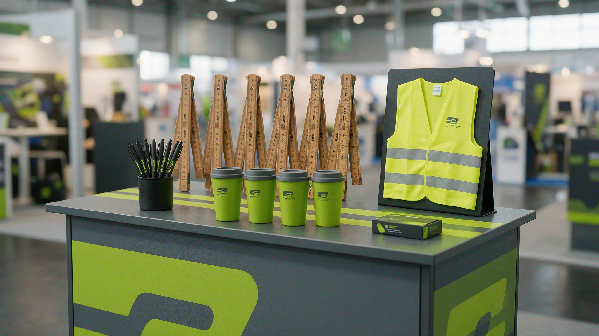

# D · Giveaway- & Print-Beschaffung (InfraTech 2027)

## 0. Kurz-Zusammenfassung
Beschaffung der Messe-Werbemittel priorisiert nach Wirkung 2026 (Renner behalten, Ballast streichen).
Ziel: rechtzeitige Produktion (Deadline **T-4 Wochen ≈ 15.12.2026**), Budget Werbemittel/Print
**3.000–3.500 €**, alle Artikel mit **Logo + QR-Code + NL-Landingpage**.

## 1. Empfohlene Mengen & Budget (Annahme: ~450 Zielkontakte, Streuartikel breiter)

| Artikel (Prio) | Menge (Richt) | Budget (Richt) |
|---|---|---|
| Zollstock mit Lasergravur (1) | 500 | 900–1.200 € |
| USB-Stick Bauhelm-Form (2) | 100 | 500–700 € |
| Warnweste mit Logo+Spruch (3) | 150 | 600–800 € |
| Isolierbecher (4) | 150 | 450–650 € |
| HARIBO-Werbetütchen (5, Streu) | 1.000 | 300–450 € |
| Flyer DIN lang + Prospektständer | 1.000 | 400–600 € |

> **Annahmen bitte bestätigen:** Mengen, Budgetobergrenze, gewünschte Nachhaltigkeit (z. B. Samentütchen
> als grünes Alternativ-Giveaway). Renner 2026 zusätzlich beibehalten: Feuerzeuge, Kugelschreiber,
> Schlüsselbänder, Einkaufwagenlöser, Steine mit Aufkleber.

## 2. Lieferanten-Briefing (Copy-Paste, an Anbieter weiterleiten)
> **Betreff:** Angebotsanfrage Messe-Werbemittel InfraTech 2027 (Fräsdienst E. Feind GmbH)
>
> Sehr geehrte Damen und Herren,
> für unseren Messeauftritt (Rotterdam, Januar 2027) bitten wir um ein Angebot inkl. Veredelung,
> Datenanlage, Muster, Liefertermin und Staffelpreisen für:
> 1. Zollstock (Holz), 4-fach-Lasergravur, Menge 500
> 2. USB-Stick in Bauhelm-Form, 16 GB, Logo-Druck, Menge 100
> 3. Warnweste EN ISO 20471, Siebdruck Front + Rücken, Menge 150 (Größen gemischt)
> 4. Isolierbecher doppelwandig, Gravur/Druck, Menge 150
> 5. HARIBO-Werbetütchen mit Logo, Menge 1.000
>
> Veredelung 4-farbig nach Logo-Vorgabe; **Lieferung bis spätestens 15.12.2026** an unsere Adresse.
> Bitte Datenformat (Vektor) und Freigabeprozess angeben. Vielen Dank!
> Mit freundlichen Grüßen, David Halko – Fräsdienst-Service E. Feind GmbH

## 3. Sprüche DE / EN / NL (freigabefertig auswählen)
| DE | EN | NL |
|---|---|---|
| „Millimeterarbeit ist unser Maßstab." | "Precision down to the millimetre." | „Precisie tot op de millimeter." |
| „Hier fräst der Profi." | "Milling done right." | „Frezen zoals het hoort." |
| „Fräsen mit Qualität seit über 30 Jahren." | "Quality milling for 30+ years." | „Kwaliteitsfrezen al meer dan 30 jaar." |
| „Vorsicht, feiner Fräser!" (Warnweste) | "Caution: fine milling!" | „Let op: fijnfrezen!" |

> **Rechtlicher Hinweis:** Marken-/Slogan-Verwendung und Bildrechte vor Druck **Rechtsabteilung prüfen**;
> NL-Übersetzungen vor Freigabe durch Muttersprachler gegenlesen.

## 4. Drei Schritte
1. **Angebote einholen** (werbeartikel.fun, Giffits, Loopper, Impulswerbung) – David · 1 Woche · Input: Logo-Vektor, Mengen.
2. **Muster + Sprüche freigeben** – David · 1 Woche · Input: finale Sprüche, QR/Landingpage-URL.
3. **Bestellung auslösen + Liefertermin sichern** – David · bis 30.11. · Input: Budgetfreigabe.

## 5. Risiken & Gegenmaßnahmen
- Lieferverzug vor Messe → früh bestellen (Puffer bis 15.12.), Liefertermin schriftlich fixieren.
- Redundanz/Ballast wie 2026 → nur Prio-1–5 + Renner; Kalender/Minzspender/große Servietten streichen (E7).
- Budgetüberschreitung → Staffelpreise vergleichen, gegen Forecast prüfen.

## 6. KPI & Check-In
Erfolg = Bestellungen bis 30.11. ausgelöst, Lieferung bis 15.12. bestätigt. Nächster Check-In: Montags-Agent.
